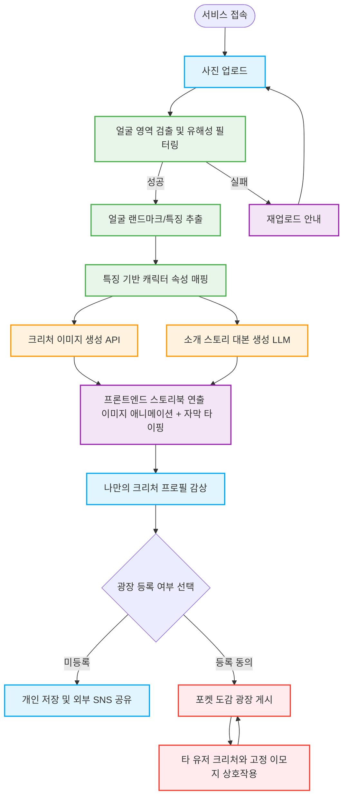

# Pokéman 프로젝트 기획안 v3 (최종)
**부제: CV 기반 아바타를 활용한 익명 힐링 소통 SNS**

**작성일:** 2026년 3월 5일
**버전:** v3.0 (TTS/영상 렌더링 서버 부하 제거 및 프론트엔드 최적화 반영)
**문서 목적:** K디지털 NVIDIA AI ACADEMY 'Pokéman' 프로젝트 최종 기획 및 MVP 스코프 정의

---

## 1. 프로젝트 비전 (Elevator Pitch)
> **"CV 기술을 결합하여, 내 얼굴 특징으로 만든 '나만의 안전한 아바타(크리처)'로 세상과 소통하는 익명 힐링 SNS"**

*   **배경 및 문제 정의:** 외모 평가에 지치거나 온라인 소통에 두려움을 느끼는 현대인들(사회적 고립 가구, 소셜 포비아 등)에게는 자신을 안전하게 드러낼 수 있는 매개체가 필요합니다.
*   **솔루션:** 사용자의 실제 얼굴을 컴퓨터 비전(CV)으로 분석하여 고유의 특징을 추출하고, 이를 긍정적이고 신비로운 '오리지널 크리처'로 치환(Positive Reframing)합니다. 이렇게 만들어진 '안전한 디지털 페르소나'를 통해 상처받지 않고 타인과 소통할 수 있는 힐링 공간을 제공합니다.

---

## 2. 서비스 흐름도 (User Flow)

---

## 3. 핵심 마일스톤 및 MVP 스코프 (3주 전략)

한정된 기간(3주)과 서버/API 비용을 고려하여, **무거운 백엔드 처리(영상 인코딩, TTS)는 과감히 덜어내고 프론트엔드 연출로 완성도를 높이는 전략**을 취합니다.

### 🚩 Phase 1 (1주 차): 코어 가치 증명 - CV 파이프라인 (필수 구현)
*   **기능:** 사진 업로드 $\rightarrow$ MediaPipe/OpenCV 기반 얼굴 특징 추출 $\rightarrow$ 특징-속성 매핑 $\rightarrow$ GenAI 이미지 및 LLM 텍스트 스토리 생성.
*   **안전망(Moderation):** 얼굴이 아니거나 부적절한 이미지(NSFW) 업로드 시 전처리 단계에서 즉각 차단하여 시스템 자원 낭비 방지.

### 🚩 Phase 2 (2주 차): '나를 소개하는 스토리북' - 멀티모달 프론트엔드 연출
*   **기능:** 생성된 정지 이미지와 텍스트를 단순 나열하지 않고, **영상처럼 느껴지는 감성적인 프로필**로 제공합니다.
*   **기술적 타협 (스코프 컷):** 서버 부하가 심한 FFmpeg 영상 렌더링 및 TTS(음성) 변환은 **비범위(Out of Scope)**로 처리합니다.
*   **구현 방식:** **[프론트엔드 렌더링]** 
    *   CSS를 활용해 크리처 이미지에 부드러운 줌인/팬아웃(Ken Burns) 효과 적용.
    *   LLM이 생성한 대본을 화면 하단에 **'타이핑 애니메이션(Typewriter Effect)' 자막**으로 출력하여, 크리처가 나에게 직접 말을 거는 듯한 생동감과 감성을 부여합니다. 잔잔한 배경음악(BGM)을 추가하여 몰입감을 높입니다.

### 🚩 Phase 3 (3주 차): 포켓 도감 광장 - 안전한 SNS 
*   **기능:** 생성된 크리처들을 한곳에 모아보는 익명 커뮤니티 공간.
*   **안전한 소통 설계:** 악플로 인한 상처를 원천 차단하기 위해 자유 텍스트 댓글 기능을 배제합니다. 대신 💖(따뜻해요), ✨(신비로워요) 등의 **긍정적인 '고정 이모지 리액션'**만 제공하여 느슨하고 안전한 연대감을 형성합니다.

---

## 4. 아키텍처 및 리스크 회피 요약 (PM 코멘트)

*   **비용 및 Latency 최적화:** 백엔드에서 영상을 합성하거나 음성을 생성하지 않으므로, API 비용을 크게 절감하고 사용자의 대기 시간(Latency)을 10초 이내로 단축할 수 있습니다.
*   **데모(Fallback) 유연성:** 3주 차에 SNS 백엔드(DB, API) 구현 시간이 부족할 경우, 프론트엔드 UI에 Mock 데이터를 붙인 '데모 모드'로 즉각 전환하여 기술 발표 시 완성도 있는 시연을 보장합니다.
*   **심사 포인트 어필:** 단순 이미지 생성을 넘어, "CV 기술을 통해 사회적 문제를 해결(안전한 소통)하고, 자원 최적화된 프론트엔드 연출로 사용자 경험(UX)을 극대화했다"는 논리로 기획 및 엔지니어링 역량을 동시에 어필합니다.
