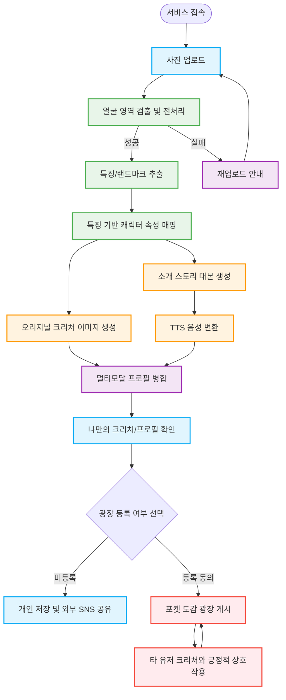

# Pokéman 프로젝트 기획안 v2 (CV 기반 멀티모달 익명 소통 SNS)

**작성일:** 2026년 3월 5일
**버전:** v2.1 (사용자 플로우차트 추가)
**문서 목적:** K디지털 NVIDIA AI ACADEMY 'Pokéman' 프로젝트의 고도화된 기획 방향성 및 MVP 핵심 기능 정의

---

## 1. 프로젝트 비전 (Elevator Pitch)
> **"CV 기술을 결합하여, 내 얼굴 특징으로 만든 '나만의 안전한 아바타(크리처)'로 세상과 소통하는 익명 힐링 SNS"**

*   **배경 및 문제 정의:** 외모 지상주의와 소셜 미디어의 평가에 지쳐 사회적으로 고립되거나(은둔형 외톨이, 소셜 포비아 등) 온라인 소통에 두려움을 느끼는 사람들이 존재합니다.
*   **해결책 (솔루션):** 사용자의 실제 얼굴 이미지를 컴퓨터 비전(CV)으로 분석하여 고유의 특징(랜드마크, 비율 등)을 추출하고, 이를 긍정적이고 신비로운 '오리지널 크리처' 속성으로 치환합니다. 현실의 외모를 숨기면서도 나의 개성은 오롯이 담긴 '안전한 디지털 페르소나'를 통해 세상과 다시 연결될 수 있는 소통의 창구를 제공합니다.

## 2. 서비스 흐름도 (User Flow)

## 3. 핵심 기술 파이프라인 (3마리 토끼)

본 프로젝트는 단순한 이미지 생성기를 넘어, 기술과 감성이 결합된 3가지 핵심 축을 가집니다.

1.  **CV (컴퓨터 비전) 엔진:** 얼굴 랜드마크 추출 및 수치화 분석을 통해 사용자의 고유한 신체적 특징을 데이터화하는 프로젝트의 근간(Core).
2.  **멀티모달 생성형 AI:** CV 데이터를 바탕으로 이미지(Stable Diffusion 등)와 텍스트(LLM 스토리)를 생성.
3.  **동적 연출 및 소셜 인터랙션 (SNS):** 생성된 정적 결과물을 가공하여 '살아 숨 쉬는 프로필'을 만들고, 유저 간의 안전한 상호작용을 유도.

## 4. 고도화된 MVP 핵심 기능 (Vibe Coding 적극 활용)

기존 계획서의 '이미지 생성'을 넘어, 소통의 매개체가 되는 **'멀티모달 프로필 영상'**과 **'안전한 광장'**을 3주 내에 구현합니다.

### [기능 1] 나만의 크리처 생성 (CV + GenAI)
*   사용자 사진 1장 업로드 $\rightarrow$ MediaPipe/OpenCV 기반 얼굴 특징 추출 $\rightarrow$ 특징-속성 매핑 룰에 따라 고유의 크리처 이미지 및 설정(타입, 성격 등) 생성.
*   *기대 효과: 외모 단점의 긍정적 재해석(Positive Reframing).*

### [기능 2] '나를 소개하는 15초 스토리북' (멀티모달 프로필 영상) 🔥 핵심 차별화 포인트
*   **개요:** 누군가 SNS 공간에서 나(내 아바타)에 대해 알고 싶을 때, 무거운 텍스트 대신 직관적이고 감성적으로 나를 소개하는 짧은 프로필 영상을 제공합니다.
*   **구현 방식 (효율성과 완성도의 타협점):**
    *   무겁고 불안정한 Full Video AI 생성 대신, **[크리처 이미지 + 배경 이미지 + LLM이 쓴 30초 자기소개 대본 + 자막(타이핑 애니메이션)]**을 결합합니다.
    *   백엔드(FFmpeg/MoviePy)에서 이미지에 가벼운 줌인/팬아웃(Ken Burns 효과)을 주고, 자막과 잔잔한 BGM을 입혀 15~30초 분량의 MP4(또는 웹 애니메이션)로 즉각 합성합니다.
*   *기대 효과: 영상 AI의 긴 대기 시간(Latency)과 비용 문제를 우회하면서도, 심사위원과 유저에게는 완벽한 멀티모달(시각+청각+동작) 경험을 선사합니다.*

### [기능 3] 포켓 도감 광장 (안전한 소셜 네트워크)
*   **개요:** 타겟 유저가 상처받지 않고 소통의 첫걸음을 뗄 수 있는 100% 무해한 커뮤니티 공간.
*   **구현 방식:**
    *   **도감 피드:** 사용자 동의(Opt-in) 하에 생성된 크리처(프로필 영상 포함)를 익명으로 전시.
    *   **안전한 상호작용:** 악플 방지를 위해 자유 텍스트 댓글을 금지하고, 긍정적인 '고정 이모지 리액션(예: 💖따뜻해요, ✨신비로워요)'과 '먹이 주기/쓰다듬기' 버튼만 제공합니다.

## 5. 리스크 관리 및 기대 효과

*   **개발 공수 리스크:** 소셜 기능과 영상 합성(FFmpeg)이 추가되어 일정이 타이트해질 수 있으나, Vibe Coding(AI 보조 코딩)을 프론트엔드/백엔드 보일러플레이트 구축에 적극 활용하여 핵심 로직 구현 시간을 확보합니다.
*   **기대 효과:**
    1.  **기술적 우수성 입증:** CV 기반 분석 $\rightarrow$ 이미지/텍스트 생성 $\rightarrow$ 오디오/영상 합성(FFmpeg 연동)으로 이어지는 촘촘한 풀스택 파이프라인 구축 능력을 증명합니다.
    2.  **사회적 임팩트 창출:** '안전한 익명 소통'이라는 명확한 사회적 문제 해결 의지를 통해 심사 과정에서 높은 공감대와 평가를 이끌어낼 수 있습니다.
