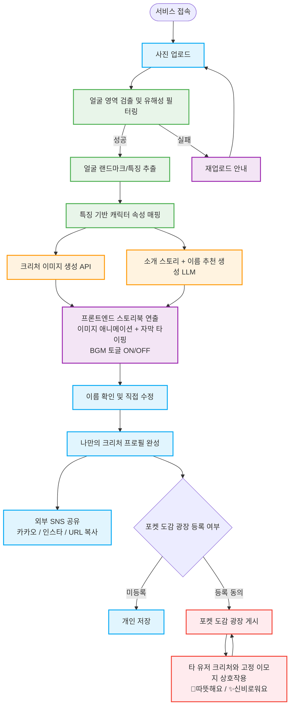

# Pokéman 프로젝트 기획안 v4 (최종 확정)
**부제: CV 기반 아바타를 활용한 익명 힐링 소통 SNS**

**작성일:** 2026년 3월 5일
**버전:** v4.0
**변경 이력:**
- v3 → v4: BGM 토글 기능으로 전환 / 외부 SNS 공유 필수 반영 / 캐릭터 이름 추천+직접 입력 방식으로 변경 / FFmpeg 영상 합성 제거 확정 / 포켓 도감 광장(SNS) 유지 확정
**문서 목적:** K디지털 NVIDIA AI ACADEMY 'Pokéman' 프로젝트 최종 기획 및 MVP 스코프 정의

---

## 1. 프로젝트 비전 (Elevator Pitch)

> **"CV 기술을 결합하여, 내 얼굴 특징으로 만든 '나만의 안전한 아바타(크리처)'로 세상과 소통하는 익명 힐링 SNS"**

- **배경 및 문제 정의:** 외모 평가에 지치거나 온라인 소통에 두려움을 느끼는 현대인들(사회적 고립 가구, 소셜 포비아 등)에게는 자신을 안전하게 드러낼 수 있는 매개체가 필요합니다.
- **솔루션:** 사용자의 실제 얼굴을 컴퓨터 비전(CV)으로 분석하여 고유의 특징을 추출하고, 이를 긍정적이고 신비로운 '오리지널 크리처'로 치환(Positive Reframing)합니다. 이렇게 만들어진 '안전한 디지털 페르소나'를 통해 상처받지 않고 타인과 소통할 수 있는 힐링 공간을 제공합니다.

---

## 2. 서비스 흐름도 (User Flow)



---

## 3. 기능 정의 (v4 확정 스코프)

### [기능 1] 나만의 크리처 생성 — CV + GenAI (Phase 1 / 필수)

- 사용자 사진 1장 업로드
- MediaPipe / OpenCV 기반 얼굴 특징 추출 (눈 간격, 얼굴형, 안경 여부 등)
- 특징-속성 매핑 룰에 따라 크리처 타입, 분위기, 외형 결정
- GenAI API로 오리지널 크리처 이미지 생성
- LLM으로 소개 스토리 생성
- NSFW/유해 이미지 입력 시 전처리 단계에서 차단

### [기능 2] 캐릭터 이름 — 추천 + 직접 입력 (Phase 1 / 필수)

- LLM이 캐릭터 속성 기반으로 이름 1개를 추천으로 제안
- 사용자가 추천 이름을 그대로 사용하거나 직접 입력하여 변경 가능
- 이름 입력 UI는 결과 확인 화면에서 인라인 편집 방식으로 제공

```
예시 화면:
┌─────────────────────────────┐
│  크리처 이름                │
│  [ 아쿠아렌        ] ✏️수정  │
│  (AI 추천 이름입니다)        │
└─────────────────────────────┘
```

### [기능 3] 스토리북 연출 — 프론트엔드 애니메이션 (Phase 2 / 필수)

- **영상 합성(FFmpeg) 없이** 프론트엔드 CSS/JS 만으로 구현
- 크리처 이미지에 CSS Ken Burns 효과 (부드러운 줌인/팬아웃)
- LLM 생성 스토리 대본을 타이핑 애니메이션(Typewriter Effect) 자막으로 출력
- **BGM 토글 기능 (ON/OFF):**
  - 기본값: OFF (발표 환경, 소음 민감 사용자 배려)
  - 사용자가 화면 내 🔇/🔊 버튼으로 직접 켜고 끔
  - 저작권 문제 없는 무료 음원 1~2종 사용 (예: Free Music Archive, Pixabay Music)
  - 브라우저 HTML5 `<audio>` 태그로 구현. 서버 관여 없음

### [기능 4] 외부 SNS 공유 (Phase 2 / 필수)

- 바이럴 확산의 핵심 기능. 결과 화면에 공유 버튼 상시 노출
- **구현 방식 (공수 최소화):**

| 공유 채널 | 구현 방법 | 난이도 |
|----------|----------|--------|
| URL 복사 | `navigator.clipboard.writeText()` | 매우 쉬움 |
| 카카오톡 공유 | Kakao JavaScript SDK (무료) | 쉬움 |
| 인스타그램 | 결과 이미지 다운로드 유도 후 직접 업로드 안내 | 쉬움 |
| X (트위터) | `https://twitter.com/intent/tweet?text=...&url=...` URL 파라미터 | 매우 쉬움 |

- 공유 시 결과 페이지 고유 URL 포함 (예: `pokeman.app/result/{uuid}`)
- 공유된 URL 접근 시 해당 크리처 결과 카드 조회 가능 (S3 이미지 + DB 조회)

### [기능 5] 포켓 도감 광장 — 안전한 SNS (Phase 3)

- 사용자 동의(Opt-in) 하에 생성된 크리처를 익명으로 광장에 게시
- 도감 피드: 크리처 이미지 + 이름 + 타입 + 스토리 카드 형태
- **안전한 상호작용:** 자유 텍스트 댓글 금지
  - 💖 따뜻해요 / ✨ 신비로워요 / 🌿 자연스러워요 고정 이모지 리액션만 허용
- **Plan A (실제 구현):** DB CRUD + 피드 API + 리액션 카운트
- **Plan B (시간 부족 시):** Mock JSON 데이터 기반 프론트엔드 Demo

---

## 4. 제거 확정 기능 (Out of Scope)

| 기능 | 제거 이유 |
|------|----------|
| FFmpeg 백엔드 영상 합성 | 서버 CPU 과부하, 배포 환경 불안정, 무료 서버에서 동작 불가. CSS 애니메이션으로 완전 대체 |
| TTS 음성 생성 | API 비용 + 서버 처리 추가. BGM 토글로 청각 경험 대체 |
| 카카오/인스타 공식 API 연동 (OAuth) | 각 플랫폼 앱 등록 및 심사 필요. 단순 URL 공유로 충분 |
| LLM 캐릭터 이름 단독 생성 | 직접 입력 기능으로 사용자 자율성 확보. LLM은 추천 1개만 제공 |

---

## 5. 아키텍처 요약

```
[Frontend - Next.js / Vercel]
  - 사진 업로드 UI
  - 스토리북 CSS 애니메이션 (Ken Burns + Typewriter)
  - BGM 토글 (HTML5 Audio, 서버 무관)
  - 이름 인라인 편집
  - 외부 공유 버튼 (URL 복사 / 카카오 SDK / 트위터 Intent)
  - 포켓 도감 광장 피드 UI

[Backend - FastAPI / Docker]
  1. 이미지 전처리 (OpenCV)
  2. NSFW 필터링 (얼굴 검출 실패 = 차단)
  3. 얼굴 특징 추출 (MediaPipe)
  4. 속성 매핑 (Rule Engine)
  5. 크리처 이미지 생성 (GenAI API) ─┐ 병렬 처리
  6. 스토리 + 이름 추천 생성 (LLM)  ─┘ (asyncio.gather)
  7. 결과 저장 (S3) + DB 기록
  8. 고유 결과 URL 반환

[Storage]
  - S3 / Cloudflare R2: 크리처 이미지 (24h TTL 또는 영구)
  - PostgreSQL: 크리처 정보, 이름, 이모지 리액션 카운트
```

---

## 6. 3주 실행 계획 (v4 기준)

### Phase 1 — 1주차: CV 코어 완성 (리소스 70% 집중)

| 과제 | 담당 | 비고 |
|------|------|------|
| 속성 매핑 테이블 확정 | 전체 합의 | Day 1 오전 필수 |
| API 명세 확정 | PM + 백엔드 | Day 1 오후 |
| Docker + GitHub Actions 세팅 | MLOps | Day 1~2 |
| 이미지 전처리 + NSFW 필터 | MLOps | Day 2~3 |
| MediaPipe 특징 추출 | CV/백엔드 | Day 3~5 |
| Rule Engine + FastAPI 엔드포인트 | 백엔드 | Day 3~5 |
| GenAI 이미지 + LLM 스토리 연동 | CV/백엔드 | Day 4~5 |
| 프론트 업로드 UI + 결과 카드 | 프론트 | Day 2~5 (Mock 병렬) |

### Phase 2 — 2주차: 연출 + 공유 기능

| 과제 | 담당 | 비고 |
|------|------|------|
| CSS Ken Burns + Typewriter 애니메이션 | 프론트 | |
| BGM 토글 (HTML5 Audio) | 프론트 | 무료 음원 확보 선행 |
| 이름 인라인 편집 UI | 프론트 | |
| 외부 공유 버튼 (URL / 카카오 / 트위터) | 프론트 | 카카오 SDK 앱 등록 필요 |
| 결과 고유 URL 페이지 (공유 랜딩) | 프론트 + 백엔드 | |
| S3 스토리지 연동 | MLOps | |
| 내부 테스트 + 에러 케이스 처리 | 전체 | |

### Phase 3 — 3주차: 광장 + 안정화

| 과제 | 담당 | 비고 |
|------|------|------|
| PostgreSQL 스키마 설계 | MLOps / 백엔드 | |
| 도감 피드 API (CRUD) | 백엔드 | Plan B 전환 기준: 3주차 월요일 |
| 이모지 리액션 카운트 API | 백엔드 | |
| 도감 피드 UI | 프론트 | |
| Sentry 모니터링 + Discord 알림 | MLOps | |
| 실사용자 테스트 (20장 이상) | 전체 | |
| 발표 데모 시나리오 + PPT | PM | |

---

## 7. 리스크 요약 (v4 기준)

| 위험도 | 항목 | 대응 |
|--------|------|------|
| 🔴 Critical | 속성 매핑 테이블 미확정 | Day 1 오전 팀 전체 합의 |
| 🔴 Critical | GenAI 이미지 품질 불일관 | 1주차 프롬프트 반복 실험 고정 |
| 🟠 High | Phase 1 1주차 미완성 | Mock API 병렬 개발로 프론트 블로킹 방지 |
| 🟠 High | API 비용 초과 | 개발 시 Mock 이미지 사용, 발표용 API 호출 제한 |
| 🟠 High | Phase 3 Plan A 미완성 | 3주차 월요일 Plan B 전환 결정 기준선 |
| 🟡 Medium | 카카오 SDK 앱 등록 지연 | 2주차 초에 즉시 등록 신청 (심사 1~3일 소요) |
| 🟡 Medium | BGM 저작권 | Pixabay Music / Free Music Archive 사전 확인 |

---

## 8. v3 → v4 변경사항 요약

| 항목 | v3 | v4 |
|------|----|----|
| BGM | 제거 | 토글 ON/OFF 기능으로 유지 |
| 외부 SNS 공유 | 선택 사항 | 필수 (바이럴 확산 핵심) |
| 캐릭터 이름 | LLM 자동 생성 | LLM 추천 1개 + 사용자 직접 입력 |
| 포켓 도감 광장 | Plan B 우선 | Plan A 목표, Plan B Fallback 유지 |
| FFmpeg 영상 합성 | 제거 확정 | 제거 확정 (재확인) |
