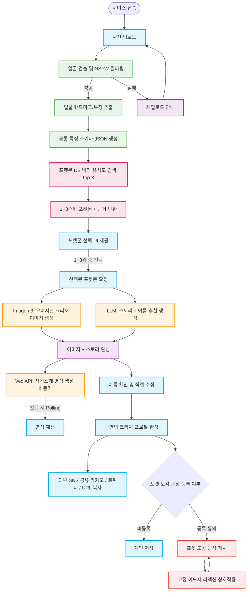

# Pokéman 프로젝트 기획안 v5 (최종 확정)
**부제: CV 기반 벡터 유사도 포켓몬 매칭 + 익명 힐링 소통 SNS**

**작성일:** 2026년 3월 6일
**버전:** v5.0
**변경 이력 요약:**
- v4 → v5: Ollama 제거 → 임베딩 기반 포켓몬 DB 매칭으로 전환
- Top-K (1~3위) 포켓몬 매칭 + 근거 제공 추가
- 포켓몬 DB 구축 전략 (1~3세대, PokeAPI + Fandom) 추가
- 공통 스키마 설계 전략 추가

---

## 1. 프로젝트 비전

> **"내 얼굴을 분석해 나와 가장 닮은 포켓몬을 찾고, 그 포켓몬 스타일의 오리지널 크리처로 세상과 소통하는 익명 힐링 SNS"**

- **배경:** 외모 평가에 지치거나 온라인 소통에 두려움을 느끼는 현대인에게 안전한 디지털 페르소나가 필요합니다.
- **솔루션:** CV로 사용자 얼굴의 시각적 특징과 인상 데이터를 추출하고, 사전 구축된 포켓몬 DB와 유사도 매칭을 수행합니다. 가장 닮은 포켓몬 Top-3를 근거와 함께 제공하고, 선택한 포켓몬을 기반으로 오리지널 크리처 이미지와 자기소개 영상을 생성합니다.

---

## 2. 서비스 흐름도 (User Flow)



---

## 3. 핵심 아키텍처 변경: Ollama 제거 → 임베딩 DB 매칭

### 변경 전 (v4)
```
사용자 이미지 → MediaPipe 수치 추출 → Ollama 멀티모달 분석 → 속성 매핑
```

### 변경 후 (v5)
```
사용자 이미지 → MediaPipe 수치 추출 → 공통 스키마 JSON 생성
                                              ↓
                                   포켓몬 DB 벡터 유사도 검색
                                              ↓
                                   Top-3 포켓몬 + 근거 반환
                                              ↓
                                   사용자가 1~3위 중 직접 선택
```

**변경 이유:**
| 항목 | Ollama 방식 | 임베딩 DB 방식 |
|------|------------|--------------|
| 서버 의존성 | 홈 GPU 서버 필수 | 없음 (DB만 필요) |
| 응답 속도 | 3~10초 (GPU 의존) | < 500ms |
| 비용 | 서버 운영 비용 | 0원 (사전 구축 후 고정) |
| 결과 일관성 | 매 요청마다 다를 수 있음 | 동일 입력 = 동일 결과 |
| 근거 제공 | LLM 생성 (불안정) | 스키마 값 기반 (명확) |
| 사용자 경험 | 단일 결과 반환 | Top-3 중 직접 선택 (참여감) |

---

## 4. 공통 특징 스키마 설계 전략 (핵심)

사람과 포켓몬이 **동일한 특징 공간(Feature Space)**에서 비교될 수 있도록 공통 스키마를 설계합니다.

### 4-1. 공통 스키마 구조 (3개 카테고리)

#### Category 1: 시각적 특징 (Visual Features)
MediaPipe로 사람에서 추출하고, Gemini Vision으로 포켓몬에서 자동 주석합니다.

```json
"visual": {
  "eye_size_score":       0.0~1.0,  // 작다(0) ~ 크다(1)
  "eye_distance_score":   0.0~1.0,  // 좁다(0) ~ 넓다(1)
  "eye_roundness_score":  0.0~1.0,  // 날카롭다(0) ~ 둥글다(1)
  "eye_tail_score":       0.0~1.0,  // 처진다(0) ~ 올라간다(1)
  "face_roundness_score": 0.0~1.0,  // 각지다(0) ~ 둥글다(1)
  "face_proportion_score":0.0~1.0,  // 가로형(0) ~ 세로형(1)
  "feature_size_score":   0.0~1.0,  // 이목구비 작다(0) ~ 크다(1)
  "feature_emphasis_score":0.0~1.0, // 이목구비 약하다(0) ~ 강하다(1)
  "mouth_curve_score":    0.0~1.0,  // 처진다(0) ~ 올라간다(1)
  "overall_symmetry":     0.0~1.0   // 비대칭(0) ~ 대칭(1)
}
```

**사람:** MediaPipe 468개 랜드마크 → 수치 계산 → 정규화
**포켓몬:** 공식 스프라이트 이미지 → Gemini Vision API → 동일 스코어 자동 생성 (1회성 배치 작업)

---

#### Category 2: 인상/성격 점수 (Impression Scores)
사람은 CV 수치에서 유추하고, 포켓몬은 도감 설명 텍스트에서 LLM으로 추출합니다.

```json
"impression": {
  "cute_score":       0.0~1.0,  // 귀여운 정도
  "calm_score":       0.0~1.0,  // 차분한 정도
  "smart_score":      0.0~1.0,  // 지적인 느낌
  "fierce_score":     0.0~1.0,  // 강렬한/맹렬한 느낌
  "gentle_score":     0.0~1.0,  // 온화하고 부드러운
  "lively_score":     0.0~1.0,  // 활발하고 에너지 넘치는
  "innocent_score":   0.0~1.0,  // 순하고 무해한
  "confident_score":  0.0~1.0,  // 당당하고 자신감 있는
  "unique_score":     0.0~1.0   // 독특하고 개성 있는
}
```

**사람의 인상 점수 산출 규칙:**
```
cute_score    ← 눈 크기(high) + 얼굴 둥글기(high) + 이목구비 작음(high)
smart_score   ← 안경 착용 + 눈썹 각도 낮음 + 눈 간격 좁음
fierce_score  ← 눈꼬리 올라감 + 눈썹 각도 높음 + 얼굴 각짐
calm_score    ← 입꼬리 중립 + 눈썹 기울기 낮음 + 전체 대칭성 높음
lively_score  ← 입꼬리 올라감 + 눈 크기 큼 + 이목구비 강조
```

**포켓몬의 인상 점수 산출 방법:**
```
포켓몬 도감 텍스트 + 타입 정보 → LLM → 인상 점수 JSON
(예: "물 타입 + 온화한 성격" → calm_score: 0.8, gentle_score: 0.7)
```

---

#### Category 3: 타입 친화도 (Type Affinity)
포켓몬의 타입을 인간 특징으로 번역하는 매핑 레이어입니다.

```json
"type_affinity": {
  "water_affinity":    0.0~1.0,  // 차분함, 깊이, 수용적
  "fire_affinity":     0.0~1.0,  // 활발함, 열정, 강렬함
  "grass_affinity":    0.0~1.0,  // 온화함, 자연친화, 느긋함
  "electric_affinity": 0.0~1.0,  // 빠름, 지적, 에너지 넘침
  "psychic_affinity":  0.0~1.0,  // 신비로움, 독특함, 직관적
  "normal_affinity":   0.0~1.0,  // 친근함, 무난함, 안정적
  "fighting_affinity": 0.0~1.0,  // 당당함, 자신감, 직선적
  "ghost_affinity":    0.0~1.0   // 조용함, 내성적, 신비로움
}
```

**포켓몬 타입 → 친화도 매핑:**
```python
TYPE_TO_AFFINITY = {
    "물":   {"water_affinity": 1.0, "calm_score": +0.3},
    "불":   {"fire_affinity": 1.0,  "fierce_score": +0.3, "lively_score": +0.2},
    "풀":   {"grass_affinity": 1.0, "gentle_score": +0.3},
    "전기": {"electric_affinity": 1.0, "smart_score": +0.2, "lively_score": +0.2},
    "에스퍼": {"psychic_affinity": 1.0, "smart_score": +0.4, "unique_score": +0.3},
    "노말": {"normal_affinity": 1.0, "innocent_score": +0.2},
    "격투": {"fighting_affinity": 1.0, "confident_score": +0.4},
    "고스트": {"ghost_affinity": 1.0, "unique_score": +0.3, "calm_score": +0.2},
}
```

**사람의 타입 친화도 산출:**
```python
# 인상 점수에서 친화도를 역산
water_affinity   ← calm_score * 0.6 + gentle_score * 0.4
fire_affinity    ← fierce_score * 0.5 + lively_score * 0.5
electric_affinity ← smart_score * 0.6 + lively_score * 0.4
psychic_affinity ← smart_score * 0.4 + unique_score * 0.6
```

---

### 4-2. 최종 특징 벡터 구성

```
사람 특징 벡터 (28차원):
  visual     (10) + impression (9) + type_affinity (8) + 기타 (1: glasses)
  = 28차원 정규화 벡터

포켓몬 특징 벡터 (28차원):
  동일한 구조
  = 28차원 정규화 벡터

유사도 계산:
  코사인 유사도 (Cosine Similarity) = dot(A, B) / (|A| * |B|)
  → 값이 1에 가까울수록 유사
```

---

## 5. 포켓몬 DB 구축 전략

### 5-1. 대상 범위

| 세대 | 번호 | 마리 수 |
|------|------|--------|
| 1세대 | #001 ~ #151 | 151마리 |
| 2세대 | #152 ~ #251 | 100마리 |
| 3세대 | #252 ~ #386 | 135마리 |
| **합계** | | **386마리** |

### 5-2. 데이터 수집 전략

#### 소스 1: PokeAPI (구조적 데이터)
```
https://pokeapi.co/api/v2/pokemon/{id}

수집 항목:
  - name (영문명)
  - types (타입 1, 타입 2)
  - stats (HP, 공격, 방어, 속도 등)
  - height / weight
  - abilities
  - sprites.front_default (공식 스프라이트 이미지 URL)

https://pokeapi.co/api/v2/pokemon-species/{id}

수집 항목:
  - names (한국어명 포함)
  - flavor_text_entries (도감 설명 - 한국어 필터링)
  - habitat (서식지: cave, forest, sea 등)
  - color (red, blue, yellow 등)
  - shape (quadruped, upright, wings 등)
  - gender_rate
  - is_legendary / is_mythical
```

#### 소스 2: 포켓몬 팬덤 위키 (한국어 보완 데이터)
```
https://pokemon.fandom.com/ko/wiki/{포켓몬명}

수집 항목:
  - 한국어 도감 설명 (PokeAPI 미포함 세대 보완)
  - 특징 묘사 텍스트
  - 진화 계열
```

#### 소스 3: Gemini Vision API (시각적 특징 자동 주석)
```
입력: 포켓몬 공식 스프라이트 이미지 (PokeAPI sprites)
프롬프트 예시:
  "이 포켓몬의 시각적 특징을 아래 JSON 형식으로 분석하세요.
   eye_size_score (0~1), eye_roundness_score (0~1),
   face_roundness_score (0~1) ..."

출력: 공통 스키마 visual JSON
비용: 386마리 × 약 $0.001 = 약 $0.4 (1회성)
```

### 5-3. DB 구축 파이프라인 (사전 작업)

```
[1단계] PokeAPI 배치 수집 (자동화 스크립트)
  for id in range(1, 387):
      pokemon_data = fetch_pokeapi(id)
      species_data = fetch_pokeapi_species(id)
      → raw_data DB 저장

[2단계] 한국어명 / 도감 설명 수집
  → PokeAPI의 flavor_text_entries에서 ko 필터링
  → 없는 경우 팬덤 위키 스크래핑으로 보완

[3단계] 시각적 특징 자동 주석 (Gemini Vision 배치)
  → 386마리 스프라이트 이미지 → Gemini Vision → visual JSON
  → 팀 검토 후 이상값 수정

[4단계] 인상/성격 점수 추출 (LLM 배치)
  → 도감 텍스트 + 타입 → Gemini Flash → impression JSON

[5단계] 타입 친화도 계산
  → TYPE_TO_AFFINITY 룰 기반 자동 계산

[6단계] 28차원 벡터 생성 및 pgvector DB 저장
  → 각 포켓몬의 정규화된 특징 벡터 저장

[7단계] 전체 검증
  → 몇 가지 테스트 케이스로 매칭 결과 확인
  → 이상한 매칭 발생 시 가중치 조정
```

---

## 6. Top-K 매칭 및 근거 제공

### 6-1. 매칭 알고리즘

```python
def find_top_pokemon(human_vector: np.ndarray, k: int = 3) -> list:
    """
    pgvector의 코사인 유사도로 Top-K 포켓몬 검색
    """
    # SQL (pgvector)
    query = """
        SELECT
            p.pokemon_id,
            p.name_kr,
            p.primary_type,
            p.secondary_type,
            1 - (pv.feature_vector <=> %s) AS similarity_score
        FROM pokemon_master p
        JOIN pokemon_vectors pv ON p.pokemon_id = pv.pokemon_id
        ORDER BY pv.feature_vector <=> %s
        LIMIT %s
    """
    return db.execute(query, [human_vector, human_vector, k])
```

### 6-2. 근거 생성 (Rule-based)

유사도 점수와 함께 **구체적인 이유**를 스키마 값 기반으로 자동 생성합니다.

```python
def generate_reasoning(human: dict, pokemon: dict) -> list[str]:
    reasons = []
    threshold = 0.15  # 유사하다고 판단하는 차이 임계값

    # 시각적 특징 근거
    if abs(human['visual']['eye_size_score']
         - pokemon['visual']['eye_size_score']) < threshold:
        level = "큰" if human['visual']['eye_size_score'] > 0.6 else "작은"
        reasons.append(f"{level} 눈이 {pokemon['name_kr']}와 닮았습니다")

    if abs(human['visual']['face_roundness_score']
         - pokemon['visual']['face_roundness_score']) < threshold:
        shape = "둥근" if human['visual']['face_roundness_score'] > 0.5 else "각진"
        reasons.append(f"{shape} 얼굴형이 {pokemon['name_kr']}와 유사합니다")

    # 인상 근거
    top_trait = max(human['impression'], key=human['impression'].get)
    TRAIT_KR = {
        "cute_score": "귀여운", "calm_score": "차분한",
        "smart_score": "지적인", "fierce_score": "강렬한",
        "gentle_score": "온화한", "lively_score": "활발한"
    }
    if pokemon['impression'][top_trait] > 0.6:
        reasons.append(
            f"{TRAIT_KR[top_trait]} 인상이 {pokemon['name_kr']}의 성격과 일치합니다"
        )

    # 타입 근거
    TYPE_DESC = {
        "물": "잔잔하고 깊이 있는", "불": "열정적이고 활발한",
        "에스퍼": "신비롭고 지적인", "전기": "빠르고 에너지 넘치는"
    }
    p_type = pokemon['primary_type']
    if p_type in TYPE_DESC and human['type_affinity'][f"{p_type}_affinity"] > 0.5:
        reasons.append(
            f"{TYPE_DESC[p_type]} 분위기가 {p_type} 타입인 {pokemon['name_kr']}와 어울립니다"
        )

    return reasons[:3]  # 최대 3가지 근거
```

### 6-3. 사용자 화면 예시

```
┌─────────────────────────────────────────────────────┐
│          당신과 가장 닮은 포켓몬 Top 3               │
├─────────────────────────────────────────────────────┤
│                                                     │
│  1위  [모부기 이미지]  모부기  유사도 87%            │
│       - 큰 눈이 모부기와 닮았습니다                  │
│       - 온화한 인상이 모부기의 성격과 일치합니다     │
│       - 잔잔하고 깊이 있는 분위기가 물 타입과 어울림 │
│  ☑ 선택                                             │
│                                                     │
│  2위  [이상해씨 이미지]  이상해씨  유사도 79%        │
│       - 둥근 얼굴형이 이상해씨와 유사합니다          │
│       - 온화하고 느긋한 인상이 풀 타입과 어울립니다  │
│  ○ 선택                                             │
│                                                     │
│  3위  [팬텀 이미지]  팬텀  유사도 71%               │
│       - 신비롭고 독특한 분위기가 고스트 타입과 어울림│
│       - 차분한 눈매가 팬텀과 닮았습니다              │
│  ○ 선택                                             │
│                                                     │
│              [선택한 포켓몬으로 시작하기]             │
└─────────────────────────────────────────────────────┘
```

---

## 7. 확정 기술 스택 (v5)

| 영역 | 기술 | 비고 |
|------|------|------|
| Frontend | Next.js + TypeScript + Tailwind CSS | Vercel 배포 |
| Backend | Python + FastAPI | Railway + Docker |
| CV | OpenCV + MediaPipe Face Mesh | 얼굴 특징 추출 |
| 벡터 검색 | PostgreSQL + pgvector | 포켓몬 유사도 검색 |
| 포켓몬 DB 구축 | PokeAPI + Fandom 위키 + Gemini Vision (배치) | 1회성 사전 작업 |
| 이미지 생성 | Imagen 3 (Google Gemini API) | 오리지널 크리처 생성 |
| 영상 생성 | Veo API (비동기) | 자기소개 영상 |
| 스토리 생성 | Gemini Flash / GPT-4o-mini | 이름 추천 + 스토리 |
| BGM | HTML5 Audio + 토글 ON/OFF | 기본값 OFF |
| 외부 공유 | 카카오 SDK + 트위터 Intent + URL 복사 | 바이럴 필수 기능 |
| NSFW 필터 | MediaPipe 얼굴 미검출 = 차단 | 안전한 광장 |

**제거 확정:**
- Ollama 홈 GPU 서버 (임베딩 DB로 대체)
- FFmpeg 영상 합성 (Veo로 대체)
- TTS 음성 생성 (범위 외)

---

## 8. 전체 기술 파이프라인

```
[사용자] 사진 업로드
          │
          ▼
[FastAPI] 수신
  ① OpenCV 전처리 (리사이즈, 품질 검사)
  ② MediaPipe 얼굴 검출 + NSFW 필터
  ③ 랜드마크 → 공통 스키마 JSON 생성 (28차원 벡터)
          │
          ▼
[pgvector] 코사인 유사도 검색
  → 포켓몬 DB에서 Top-3 매칭
  → 각 포켓몬 근거 생성 (Rule-based)
  → 응답: [{pokemon, similarity, reasons}, ...]
          │
          ▼
[Frontend] Top-3 포켓몬 선택 UI 표시
  → 사용자가 1~3위 중 1마리 선택
          │
          ▼
[FastAPI] 선택된 포켓몬 기반 생성 파이프라인
  ┌───────────────────┬───────────────────┐
  │ (병렬 처리)        │                   │
  ▼                   ▼                   ▼
Imagen 3            Gemini Flash       Veo API
오리지널 크리처      이름 추천 +        자기소개 영상
이미지 생성          스토리 생성        (비동기 Job 등록)
  │                   │                   │
  └───────────────────┘                   │
          │ 즉시 반환                      │ Job ID 반환
          ▼                               ▼
[Frontend]                        Polling (3초마다)
이름 편집 + 프로필 확인             → 완료 시 영상 재생
          │
          ├─ 외부 공유 (카카오/트위터/URL)
          └─ 포켓 도감 광장 등록 (Opt-in)
```

---

## 9. DB 스키마 (v5 최종)

```sql
-- 포켓몬 기본 정보
CREATE TABLE pokemon_master (
    pokemon_id       INTEGER PRIMARY KEY,   -- 전국도감 번호
    name_kr          VARCHAR(20) NOT NULL,
    name_en          VARCHAR(20) NOT NULL,
    generation       SMALLINT NOT NULL,     -- 1/2/3
    primary_type     VARCHAR(10) NOT NULL,
    secondary_type   VARCHAR(10),
    habitat          VARCHAR(20),           -- forest, sea, cave 등
    color            VARCHAR(10),
    shape            VARCHAR(20),
    is_legendary     BOOLEAN DEFAULT FALSE,
    pokedex_text_kr  TEXT,                  -- 한국어 도감 설명
    sprite_url       TEXT                   -- 공식 스프라이트 URL
);

-- 포켓몬 시각적 특징 (Gemini Vision 자동 주석)
CREATE TABLE pokemon_visual (
    pokemon_id              INTEGER PRIMARY KEY REFERENCES pokemon_master,
    eye_size_score          FLOAT,
    eye_distance_score      FLOAT,
    eye_roundness_score     FLOAT,
    eye_tail_score          FLOAT,
    face_roundness_score    FLOAT,
    face_proportion_score   FLOAT,
    feature_size_score      FLOAT,
    feature_emphasis_score  FLOAT,
    mouth_curve_score       FLOAT,
    overall_symmetry        FLOAT
);

-- 포켓몬 인상/성격 점수 (LLM 도감 분석)
CREATE TABLE pokemon_impression (
    pokemon_id       INTEGER PRIMARY KEY REFERENCES pokemon_master,
    cute_score       FLOAT,
    calm_score       FLOAT,
    smart_score      FLOAT,
    fierce_score     FLOAT,
    gentle_score     FLOAT,
    lively_score     FLOAT,
    innocent_score   FLOAT,
    confident_score  FLOAT,
    unique_score     FLOAT
);

-- 포켓몬 타입 친화도 (룰 기반 자동 계산)
CREATE TABLE pokemon_type_affinity (
    pokemon_id          INTEGER PRIMARY KEY REFERENCES pokemon_master,
    water_affinity      FLOAT,
    fire_affinity       FLOAT,
    grass_affinity      FLOAT,
    electric_affinity   FLOAT,
    psychic_affinity    FLOAT,
    normal_affinity     FLOAT,
    fighting_affinity   FLOAT,
    ghost_affinity      FLOAT
);

-- 포켓몬 통합 벡터 (pgvector 검색용)
CREATE TABLE pokemon_vectors (
    pokemon_id       INTEGER PRIMARY KEY REFERENCES pokemon_master,
    feature_vector   vector(28)  -- pgvector 타입
);
CREATE INDEX ON pokemon_vectors USING ivfflat (feature_vector vector_cosine_ops);

-- 사용자 크리처
CREATE TABLE creatures (
    id               UUID PRIMARY KEY DEFAULT gen_random_uuid(),
    matched_pokemon_id INTEGER REFERENCES pokemon_master,  -- 선택된 포켓몬
    match_rank       SMALLINT,         -- 1/2/3위 중 선택
    similarity_score FLOAT,
    match_reasons    JSONB,            -- 근거 배열
    name             VARCHAR(20),      -- 사용자가 지은/수정한 이름
    story            TEXT,
    image_url        TEXT,
    video_url        TEXT,
    is_public        BOOLEAN DEFAULT FALSE,
    created_at       TIMESTAMP DEFAULT NOW()
);

-- Veo Job 상태 관리
CREATE TABLE veo_jobs (
    id           UUID PRIMARY KEY DEFAULT gen_random_uuid(),
    creature_id  UUID REFERENCES creatures(id),
    status       VARCHAR(20) DEFAULT 'pending',
    video_url    TEXT,
    created_at   TIMESTAMP DEFAULT NOW(),
    updated_at   TIMESTAMP DEFAULT NOW()
);

-- 이모지 리액션
CREATE TABLE reactions (
    id           UUID PRIMARY KEY DEFAULT gen_random_uuid(),
    creature_id  UUID REFERENCES creatures(id),
    emoji_type   VARCHAR(20) NOT NULL,
    created_at   TIMESTAMP DEFAULT NOW()
);
```

---

## 10. Phase별 구현 계획 (3주)

### Phase 1 — 1주차: CV + 포켓몬 DB 매칭 코어 (리소스 70%)

| 과제 | 담당 | 우선순위 |
|------|------|--------|
| 공통 스키마 최종 확정 (팀 전체) | 전체 | Day 1 오전 필수 |
| API 명세 확정 | PM + 백엔드 | Day 1 오후 |
| PokeAPI 배치 수집 스크립트 | MLOps | Day 1~2 |
| Gemini Vision 시각 특징 주석 배치 | MLOps | Day 2~3 |
| LLM 인상 점수 추출 배치 | MLOps | Day 2~3 |
| 타입 친화도 자동 계산 | 백엔드 | Day 3 |
| pgvector DB 구축 + 벡터 인덱스 | MLOps | Day 3~4 |
| MediaPipe → 공통 스키마 변환 모듈 | CV/백엔드 | Day 2~4 |
| Top-K 검색 + 근거 생성 API | 백엔드 | Day 4~5 |
| 프론트 Top-3 선택 UI | 프론트 | Day 3~5 (Mock 병렬) |

### Phase 2 — 2주차: 생성 파이프라인 + 연출

| 과제 | 담당 |
|------|------|
| Imagen 3 크리처 이미지 생성 연동 | CV/백엔드 |
| Gemini Flash 스토리+이름 생성 연동 | 백엔드 |
| Veo 비동기 Job + Polling 구조 | MLOps |
| CSS Fallback 애니메이션 (Veo 실패 시) | 프론트 |
| BGM 토글 (HTML5 Audio) | 프론트 |
| 이름 인라인 편집 UI | 프론트 |
| 외부 공유 버튼 (카카오/트위터/URL) | 프론트 |
| S3 이미지/영상 스토리지 연동 | MLOps |

### Phase 3 — 3주차: 광장 + 안정화

| 과제 | Plan A | Plan B (Fallback) |
|------|--------|------------------|
| 포켓 도감 광장 피드 | DB CRUD + API | Mock JSON |
| 이모지 리액션 | 서버 카운트 저장 | 프론트 상태값만 |
| 실사용자 테스트 | 20장 이상 테스트 | — |
| 발표 데모 시나리오 | PPT + 시연 스크립트 | — |

**Plan B 전환 기준: 3주차 월요일 오전 Phase 1+2 안정성 미확보 시 즉시 전환**

---

## 11. 리스크 매트릭스 (v5)

| 위험도 | 항목 | 대응 |
|--------|------|------|
| 🔴 Critical | 공통 스키마 Day 1 미확정 | 전체 파이프라인 블로킹 → 반드시 Day 1 확정 |
| 🔴 Critical | 포켓몬 시각 특징 주석 품질 낮음 | Gemini Vision 결과 팀 전체 검토 + 이상값 수정 |
| 🔴 Critical | NSFW 이미지 광장 노출 | MediaPipe 얼굴 미검출 = 즉시 차단 |
| 🟠 High | Veo 생성 1~3분 대기 | 비동기 + 로딩 UX + CSS Fallback 자동 전환 |
| 🟠 High | 포켓몬 IP 리스크 | 내부 발표 한정. 공개 서비스화 전 오리지널 전환 검토 |
| 🟠 High | pgvector 매칭 결과 부자연스러움 | 가중치 튜닝 + 테스트 20케이스 이상 검증 |
| 🟠 High | 카카오 SDK 앱 등록 지연 | 2주차 시작일 즉시 등록 신청 |
| 🟡 Medium | PokeAPI rate limit | 배치 수집 시 딜레이(100ms) + 캐싱 |
| 🟡 Medium | Imagen 3 프롬프트 일관성 | 1주차 반복 실험으로 프롬프트 고정 |
| 🟡 Medium | API 비용 초과 | 개발 시 Mock 이미지, 발표 직전 실 API |

---

## 12. v4 → v5 변경사항 요약

| 항목 | v4 | v5 |
|------|----|----|
| LLM 서버 | Ollama 홈 서버 (선택) | 제거 |
| 얼굴 분석 | Ollama 멀티모달 | MediaPipe 수치 → 공통 스키마 |
| 포켓몬 매칭 | Rule-based 속성 매핑 | **pgvector 코사인 유사도 Top-K** |
| 결과 제공 | 단일 캐릭터 | **Top-3 포켓몬 + 근거 + 사용자 선택** |
| 포켓몬 DB | 미정 | **1~3세대 386마리, PokeAPI + Gemini Vision 배치 구축** |
| 공통 스키마 | 미정 | **28차원: 시각(10) + 인상(9) + 타입친화도(8) + 기타(1)** |
| BGM | 토글 ON/OFF | 동일 유지 |
| 외부 공유 | 필수 | 동일 유지 |
| 이름 | LLM 추천 + 직접 입력 | 동일 유지 |
| 영상 생성 | Veo API | 동일 유지 |
| SNS 광장 | 포켓 도감 광장 | 동일 유지 |
