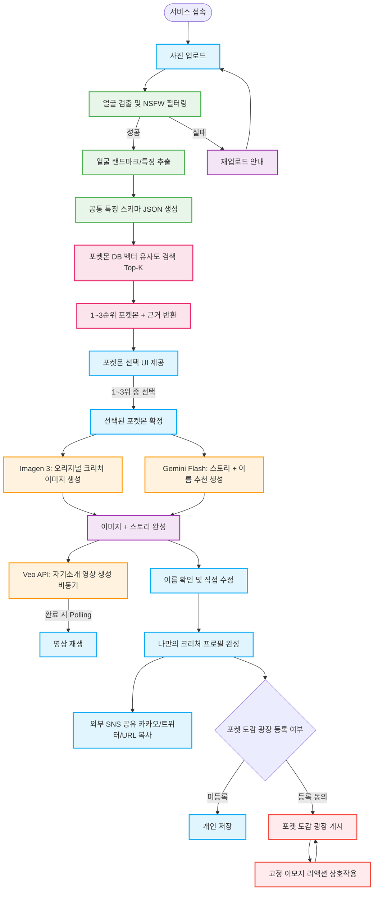
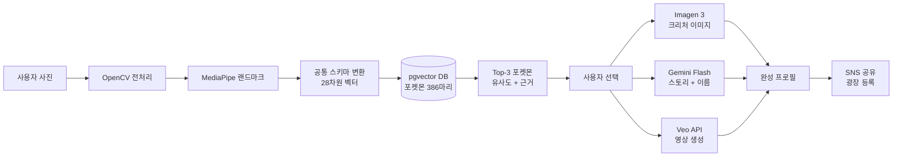

# Pokéman 프로젝트 기획안 v5 (최종 확정)
**부제: CV 기반 벡터 유사도 포켓몬 매칭 + 익명 힐링 소통 SNS**

| 항목 | 내용 |
|------|------|
| 작성일 | 2026년 3월 6일 |
| 버전 | v5.0 (최종 확정) |
| 팀 | 5박사연구소 |
| 과정 | K디지털 NVIDIA AI ACADEMY |

**변경 이력:**

| 버전 | 주요 변경 |
|------|----------|
| v1 | 초안 작성 |
| v2 | 멀티모달 SNS 기능 추가 |
| v3 | 구현 전략 구체화 |
| v4 | BGM 토글 / 외부 공유 / Veo API 확정 / FFmpeg 제거 |
| **v5** | **Ollama 제거 → pgvector 임베딩 매칭 전환, Top-K 선택 UI, 포켓몬 DB 구축 전략** |

---

## 1. 프로젝트 비전

> **"내 얼굴을 분석해 나와 가장 닮은 포켓몬을 찾고, 그 포켓몬 스타일의 오리지널 크리처로 세상과 소통하는 익명 힐링 SNS"**

| 구분 | 내용 |
|------|------|
| 배경 | 외모 평가에 지치거나 온라인 소통에 두려움을 느끼는 현대인에게 안전한 디지털 페르소나가 필요함 |
| 솔루션 | CV로 얼굴 특징을 추출 → 사전 구축된 포켓몬 DB와 벡터 유사도 매칭 → Top-3 포켓몬 제시 → 선택 → 오리지널 크리처 + 영상 생성 |
| 타겟 | MZ세대, 포켓몬 팬, SNS 콘텐츠 소비자 |
| 차별점 | 단순 결과 제공이 아닌 Top-3 근거 제시 + 사용자 직접 선택으로 참여감 강화 |

---

## 2. 전체 시스템 아키텍처 한눈에 보기

```
┌─────────────────────────────────────────────────────────────────────────────────┐
│                         Pokéman 전체 시스템 아키텍처                              │
├───────────────┬─────────────────────────────────┬───────────────────────────────┤
│  사용자 (User) │     서비스 레이어 (Service)       │   외부 API / 인프라              │
├───────────────┼─────────────────────────────────┼───────────────────────────────┤
│               │                                 │                               │
│   [브라우저]   │  ┌──────────┐  ┌─────────────┐ │  ┌─────────────────────────┐  │
│               │  │ Next.js  │  │   FastAPI   │ │  │    Google Gemini API    │  │
│  사진 업로드   │  │ Frontend │  │   Backend   │ │  │  ┌──────┐ ┌──────────┐ │  │
│  ──────────▶  │  │ (Vercel) │◀▶│  (Railway)  │ │  │  │ Veo  │ │ Imagen3  │ │  │
│               │  └──────────┘  └──────┬──────┘ │  │  │ API  │ │  (이미지)│ │  │
│  포켓몬 선택   │                       │         │  │  └──────┘ └──────────┘ │  │
│  ──────────▶  │                       │         │  │  ┌────────────────────┐ │  │
│               │                       ▼         │  │  │    Gemini Flash    │ │  │
│  이름 편집    │               ┌───────────────┐  │  │  │  (스토리/이름 생성)│ │  │
│  ──────────▶  │               │  CV Pipeline  │  │  │  └────────────────┘ │  │
│               │               │  ┌─────────┐  │  │  └─────────────────────────┘  │
│  SNS 공유     │               │  │OpenCV   │  │  │                               │
│               │               │  │+MediaPipe│  │  │  ┌─────────────────────────┐  │
│               │               │  └─────────┘  │  │  │      PokeAPI            │  │
│               │               └───────┬───────┘  │  │  pokeapi.co (DB 구축용) │  │
│               │                       │           │  │  (사전 배치 작업만 사용) │  │
│               │                       ▼           │  └─────────────────────────┘  │
│               │               ┌───────────────┐  │                               │
│               │               │  PostgreSQL   │  │  ┌─────────────────────────┐  │
│               │               │  + pgvector  │  │  │   AWS S3 / Cloudflare  │  │
│               │               │  (포켓몬 DB)  │  │  │   이미지/영상 스토리지  │  │
│               │               └───────────────┘  │  └─────────────────────────┘  │
└───────────────┴─────────────────────────────────┴───────────────────────────────┘
```

---

## 3. 서비스 흐름도 (User Flow)



---

## 4. MLOps 파이프라인 시스템 아키텍처

### 4-1. 전체 파이프라인 흐름도

```
═══════════════════════════════════════════════════════════════════════════════
                     MLOps PIPELINE ARCHITECTURE
═══════════════════════════════════════════════════════════════════════════════

 [사전 준비 파이프라인] ← 배포 전 1회성 배치 작업
 ─────────────────────────────────────────────────────────────────────────────

  PokeAPI (#001~#386)           Pokémon Fandom Wiki
       │                               │
       ▼                               ▼
  ┌─────────────────────────────────────────┐
  │  [Step 1] 구조 데이터 배치 수집          │
  │  pokemon_id, name_kr/en, types,         │
  │  stats, height, weight, sprite_url      │
  └─────────────────────┬───────────────────┘
                        │
                        ▼
  ┌─────────────────────────────────────────┐
  │  [Step 2] 한국어 도감 설명 수집          │
  │  PokeAPI flavor_text (ko 필터)          │
  │  → 없으면 Fandom 위키 보완 스크래핑     │
  └─────────────────────┬───────────────────┘
                        │
           ┌────────────┴────────────┐
           │                        │
           ▼                        ▼
  ┌──────────────────┐   ┌──────────────────────┐
  │  [Step 3]        │   │  [Step 4]            │
  │  Gemini Vision   │   │  Gemini Flash LLM    │
  │  시각 특징 주석  │   │  인상/성격 점수 추출  │
  │  (스프라이트→    │   │  (도감 텍스트→       │
  │  visual 10차원)  │   │  impression 9차원)   │
  └────────┬─────────┘   └──────────┬───────────┘
           │                        │
           └────────────┬───────────┘
                        │
                        ▼
  ┌─────────────────────────────────────────┐
  │  [Step 5] 타입 친화도 자동 계산          │
  │  TYPE_TO_AFFINITY 룰 기반               │
  │  → type_affinity 8차원                  │
  └─────────────────────┬───────────────────┘
                        │
                        ▼
  ┌─────────────────────────────────────────┐
  │  [Step 6] 28차원 벡터 생성 및 저장      │
  │  visual(10) + impression(9)             │
  │  + type_affinity(8) + 기타(1)          │
  │  → PostgreSQL + pgvector 저장           │
  │  → IVFFlat 인덱스 생성                  │
  └─────────────────────┬───────────────────┘
                        │
                        ▼
  ┌─────────────────────────────────────────┐
  │  [Step 7] 전체 검증                     │
  │  20+ 테스트 케이스 매칭 확인            │
  │  이상값 발견 시 가중치 조정             │
  └─────────────────────────────────────────┘

 ─────────────────────────────────────────────────────────────────────────────
 [실시간 서비스 파이프라인] ← 사용자 요청마다 실행
 ─────────────────────────────────────────────────────────────────────────────

  사용자 사진 업로드
       │
       ▼
  ┌─────────────────────────────────────────┐
  │  [FastAPI] 수신 및 전처리               │
  │  ┌─────────────────────────────────┐   │
  │  │ OpenCV: 리사이즈, 품질 검사      │   │
  │  │ MediaPipe: 얼굴 검출 + NSFW 판별│   │
  │  └─────────────────────────────────┘   │
  └─────────────────────┬───────────────────┘
                        │ 얼굴 검출 성공
                        ▼
  ┌─────────────────────────────────────────┐
  │  [CV 특징 추출]                          │
  │  MediaPipe 468개 랜드마크               │
  │  → 수치 계산 → 0.0~1.0 정규화          │
  │  → 공통 스키마 JSON 생성 (28차원 벡터) │
  └─────────────────────┬───────────────────┘
                        │
                        ▼
  ┌─────────────────────────────────────────┐
  │  [pgvector 유사도 검색]   < 500ms      │
  │  코사인 유사도(Cosine Similarity)       │
  │  → 포켓몬 DB 386마리 중 Top-3 반환     │
  │  → 근거 문장 Rule-based 자동 생성      │
  └─────────────────────┬───────────────────┘
                        │
                        ▼
              [사용자 선택 대기]
              Top-3 포켓몬 + 근거 UI
                        │
                        ▼
  ┌─────────────────────────────────────────┐
  │  [생성 파이프라인]  병렬 실행           │
  │                                         │
  │   ┌─────────────┐    ┌──────────────┐  │
  │   │  Imagen 3   │    │ Gemini Flash │  │
  │   │  크리처 이미지│    │ 스토리+이름  │  │
  │   │  생성 (~10s) │    │ 생성 (~5s)   │  │
  │   └──────┬──────┘    └──────┬───────┘  │
  │          └────────┬─────────┘          │
  │                   ▼                     │
  │   ┌───────────────────────────────┐    │
  │   │  Veo API  비동기 Job 등록     │    │
  │   │  자기소개 영상 생성 (1~3분)   │    │
  │   │  → Job ID 반환 → Polling      │    │
  │   └───────────────────────────────┘    │
  └─────────────────────────────────────────┘
                        │
                        ▼
            [결과물 S3 저장 + CDN]
                        │
                        ▼
         [프론트엔드 프로필 완성 화면]
              SNS 공유 / 광장 등록
```

### 4-2. 아키텍처 구성 요소별 역할

| 레이어 | 구성 요소 | 역할 | 배포 위치 |
|--------|----------|------|----------|
| **Frontend** | Next.js + Tailwind CSS | UI 렌더링, 사진 업로드, Top-3 선택 UI, Polling | Vercel |
| **Backend** | FastAPI + Python | 요청 수신, CV 파이프라인 오케스트레이션, API 라우팅 | Railway (Docker) |
| **CV** | OpenCV + MediaPipe | 얼굴 검출, NSFW 필터, 468 랜드마크 추출 | Backend 내장 |
| **벡터 DB** | PostgreSQL + pgvector | 포켓몬 28차원 벡터 저장, 코사인 유사도 검색 | Railway (DB) |
| **이미지 생성** | Imagen 3 (Gemini API) | 오리지널 크리처 이미지 생성 | Google Cloud |
| **스토리 생성** | Gemini Flash | 이름 추천 + 포켓몬 스타일 스토리 | Google Cloud |
| **영상 생성** | Veo API (비동기) | 크리처 자기소개 영상 1~3분 생성 | Google Cloud |
| **스토리지** | AWS S3 / Cloudflare R2 | 이미지, 영상 저장 및 CDN 서빙 | Cloud |
| **공유** | 카카오 SDK + 트위터 Intent | 외부 SNS 바이럴 공유 | 프론트 SDK |

### 4-3. 데이터 흐름 시각화



---

## 5. 핵심 아키텍처 변경: Ollama 제거 → 임베딩 DB 매칭

### 변경 전후 비교

```
[v4 방식]                              [v5 방식]
──────────────────────────────         ──────────────────────────────
사용자 이미지                           사용자 이미지
    ↓                                      ↓
MediaPipe 수치 추출                    MediaPipe 수치 추출
    ↓                                      ↓
Ollama 멀티모달 LLM 분석               공통 스키마 JSON 생성 (28차원)
(홈 GPU 서버 의존)                         ↓
    ↓                              pgvector 코사인 유사도 검색
규칙 기반 속성 매핑                         ↓
    ↓                                  Top-3 포켓몬 + 근거 반환
단일 결과 반환                              ↓
                                    사용자 직접 선택
```

### 방식별 비교표

| 평가 항목 | Ollama 방식 (v4) | pgvector 임베딩 방식 (v5) | 승자 |
|----------|-----------------|--------------------------|------|
| 서버 의존성 | 홈 GPU 서버 필수 | 없음 (DB만 필요) | v5 |
| 응답 속도 | 3~10초 (GPU 성능 의존) | < 500ms | v5 |
| 비용 (월) | 서버 전기세 + 유지비 | 0원 (DB 구축 후 고정) | v5 |
| 결과 일관성 | 매 요청마다 다를 수 있음 | 동일 입력 = 동일 결과 | v5 |
| 근거 제공 | LLM 생성 (불안정) | 스키마 값 기반 (명확) | v5 |
| 사용자 경험 | 단일 결과 | Top-3 중 직접 선택 (참여감) | v5 |
| 구현 복잡도 | 홈 서버 배포 + 터널 | DB 구축 배치 작업 | v5 |

---

## 6. 공통 특징 스키마 설계 전략

> 사람과 포켓몬이 **동일한 28차원 특징 공간(Feature Space)**에서 비교되도록 설계

### 6-1. 28차원 벡터 구조 한눈에 보기

```
┌─────────────────────────────────────────────────────────────────┐
│                    28차원 공통 특징 벡터                         │
├────────────────────┬───────────────────┬────────────────────────┤
│  Visual (시각)      │ Impression (인상)  │  Type Affinity (타입)  │
│     10차원          │      9차원          │       8차원 + 기타1    │
├────────────────────┼───────────────────┼────────────────────────┤
│ eye_size           │ cute              │ water                  │
│ eye_distance       │ calm              │ fire                   │
│ eye_roundness      │ smart             │ grass                  │
│ eye_tail           │ fierce            │ electric               │
│ face_roundness     │ gentle            │ psychic                │
│ face_proportion    │ lively            │ normal                 │
│ feature_size       │ innocent          │ fighting               │
│ feature_emphasis   │ confident         │ ghost                  │
│ mouth_curve        │ unique            │ [+ glasses: 0/1]       │
│ overall_symmetry   │                   │                        │
├────────────────────┴───────────────────┴────────────────────────┤
│ 모든 값: 0.0 ~ 1.0 정규화                                       │
│ 유사도: Cosine Similarity (내적 / 크기의 곱)                     │
└─────────────────────────────────────────────────────────────────┘
```

### 6-2. 사람 vs 포켓몬 데이터 추출 방법 비교

| 차원 카테고리 | 사람 (추출 방법) | 포켓몬 (주석 방법) |
|-------------|----------------|-----------------|
| **시각 (Visual)** | MediaPipe 468 랜드마크 → 수치 계산 → 정규화 | Gemini Vision API → 스프라이트 이미지 분석 → JSON |
| **인상 (Impression)** | 시각 수치에서 유추 (규칙 기반 산출) | Gemini Flash → 도감 텍스트 + 타입 분석 → JSON |
| **타입 친화도** | 인상 점수에서 역산 (가중치 공식) | TYPE_TO_AFFINITY 룰 테이블 자동 계산 |

### 6-3. Category 1: 시각적 특징 (Visual Features)

| 스코어 | 낮음 (0.0) | 높음 (1.0) | 사람 추출 기준 |
|--------|-----------|-----------|-------------|
| eye_size | 작은 눈 | 큰 눈 | 눈 세로 / 얼굴 세로 |
| eye_distance | 좁은 미간 | 넓은 미간 | 미간 / 얼굴 가로 |
| eye_roundness | 날카로운 눈 | 둥근 눈 | 눈 가로:세로 비율 |
| eye_tail | 처진 눈꼬리 | 올라간 눈꼬리 | 눈 끝 각도 (+ = 올라감) |
| face_roundness | 각진 얼굴 | 둥근 얼굴 | 턱선 각도 역산 |
| face_proportion | 가로형 얼굴 | 세로형 얼굴 | 얼굴 가로/세로 비율 역산 |
| feature_size | 이목구비 작음 | 이목구비 큼 | 코+입 너비 / 얼굴 가로 |
| feature_emphasis | 이목구비 약함 | 이목구비 강함 | 눈썹 두께 + 코볼 너비 합산 |
| mouth_curve | 처진 입꼬리 | 올라간 입꼬리 | smile_score |
| overall_symmetry | 비대칭 | 대칭 | 좌우 랜드마크 거리 편차 |

### 6-4. Category 2: 인상/성격 점수 (Impression Scores)

| 스코어 | 사람 산출 규칙 | 포켓몬 산출 |
|--------|-------------|-----------|
| cute | eye_size(H) + face_roundness(H) + feature_size(L) | 도감 "귀여운", 작은 체형 |
| calm | mouth_curve(중립) + overall_symmetry(H) + eye_tail(낮음) | 도감 "온순한", 물/풀 타입 |
| smart | 안경(+1.0) + eye_distance(L) + eye_roundness(L) | 도감 "지능이 높은", 에스퍼/전기 |
| fierce | eye_tail(H) + face_roundness(L) + feature_emphasis(H) | 도감 "사납다", 격투/악 타입 |
| gentle | mouth_curve(H) + face_roundness(H) | 도감 "온화한", 노말/페어리 |
| lively | mouth_curve(H) + eye_size(H) + feature_emphasis(H) | 도감 "활발한", 불/전기 |
| innocent | face_roundness(H) + eye_roundness(H) + feature_size(L) | 도감 "순진한", 노말 |
| confident | face_proportion(낮음) + face_roundness(L) | 도감 "당당한", 격투 |
| unique | eye_tail(극값) + feature_emphasis(H) | 도감 "수수께끼", 고스트/에스퍼 |

### 6-5. Category 3: 타입 친화도 (Type Affinity)

| 타입 | 친화도 산출 공식 | 연결된 인상 |
|------|---------------|-----------|
| water | calm × 0.6 + gentle × 0.4 | 차분함, 깊이 |
| fire | fierce × 0.5 + lively × 0.5 | 활발함, 열정 |
| grass | gentle × 0.6 + calm × 0.4 | 온화함, 자연친화 |
| electric | smart × 0.6 + lively × 0.4 | 빠름, 지적, 에너지 |
| psychic | smart × 0.4 + unique × 0.6 | 신비로움, 독특함 |
| normal | innocent × 0.6 + gentle × 0.4 | 친근함, 무난함 |
| fighting | confident × 0.7 + fierce × 0.3 | 당당함, 직선적 |
| ghost | unique × 0.5 + calm × 0.5 | 조용함, 내성적 |

---

## 7. 포켓몬 DB 구축 전략 (사전 배치 작업)

### 7-1. 대상 범위

| 세대 | 번호 범위 | 마리 수 | 대표 포켓몬 |
|------|---------|--------|------------|
| 1세대 | #001 ~ #151 | 151마리 | 이상해씨, 파이리, 꼬부기 |
| 2세대 | #152 ~ #251 | 100마리 | 치코리타, 브케인, 리아코 |
| 3세대 | #252 ~ #386 | 135마리 | 나무지기, 아차모, 물짱이 |
| **합계** | #001 ~ #386 | **386마리** | |

### 7-2. 데이터 소스 및 수집 전략

```
┌────────────────────────────────────────────────────────────────┐
│                     데이터 소스 맵                              │
├──────────────────┬─────────────────────────────────────────────┤
│   소스            │ 수집 항목                                    │
├──────────────────┼─────────────────────────────────────────────┤
│ PokeAPI          │ id, name_en, types, stats, height, weight,  │
│ (구조 데이터)     │ abilities, sprite_url, color, shape, habitat│
│                  │ flavor_text (ko 필터), is_legendary         │
├──────────────────┼─────────────────────────────────────────────┤
│ Fandom 위키      │ 한국어 도감 설명 보완                        │
│ (한국어 보완)     │ (PokeAPI에 ko 미포함 세대 보완)              │
├──────────────────┼─────────────────────────────────────────────┤
│ Gemini Vision    │ visual 10차원 스코어 자동 주석              │
│ (시각 특징 주석)  │ 스프라이트 이미지 → JSON                    │
│                  │ 비용: 386마리 × ~$0.001 = 약 $0.4 (1회성)  │
├──────────────────┼─────────────────────────────────────────────┤
│ Gemini Flash     │ impression 9차원 스코어 자동 추출           │
│ (인상 점수)       │ 도감 텍스트 + 타입 → JSON                   │
└──────────────────┴─────────────────────────────────────────────┘
```

### 7-3. DB 구축 7단계 파이프라인

```
Step 1  ┌──────────────────────────────────────────────┐
        │ PokeAPI 배치 수집                              │
        │ for id in range(1, 387):                     │
        │     pokemon_data = fetch_pokeapi(id)         │
        │     species_data = fetch_pokeapi_species(id) │
        │     → raw_data PostgreSQL 저장               │
        │ [딜레이: 100ms/호출, rate limit 방지]         │
        └──────────────────────────────────────────────┘
               │
Step 2  ┌──────────────────────────────────────────────┐
        │ 한국어명 / 도감 설명 수집 및 보완              │
        │ → flavor_text_entries에서 ko 필터링           │
        │ → 없는 경우 Fandom 위키 스크래핑 보완         │
        └──────────────────────────────────────────────┘
               │
Step 3  ┌──────────────────────────────────────────────┐
        │ Gemini Vision 시각 특징 주석 배치             │
        │ 입력: 스프라이트 이미지 URL                   │
        │ 출력: visual 10차원 JSON                     │
        │ → 팀 전체 검토 후 이상값 수정                 │
        └──────────────────────────────────────────────┘
               │
Step 4  ┌──────────────────────────────────────────────┐
        │ Gemini Flash 인상 점수 추출 배치              │
        │ 입력: 도감 텍스트 + 타입 정보                 │
        │ 출력: impression 9차원 JSON                  │
        └──────────────────────────────────────────────┘
               │
Step 5  ┌──────────────────────────────────────────────┐
        │ 타입 친화도 자동 계산                          │
        │ TYPE_TO_AFFINITY 룰 기반 자동 계산            │
        │ → type_affinity 8차원 값 생성                │
        └──────────────────────────────────────────────┘
               │
Step 6  ┌──────────────────────────────────────────────┐
        │ 28차원 벡터 생성 및 pgvector DB 저장          │
        │ visual(10) + impression(9)                   │
        │ + type_affinity(8) + glasses(1)              │
        │ → 정규화 후 vector(28) 타입 저장              │
        │ → IVFFlat 코사인 인덱스 생성                  │
        └──────────────────────────────────────────────┘
               │
Step 7  ┌──────────────────────────────────────────────┐
        │ 전체 검증 및 튜닝                              │
        │ → 20+ 테스트 케이스 매칭 확인                 │
        │ → 이상한 매칭 발견 시 가중치 조정             │
        │ → 팀 전체 리뷰 후 확정                        │
        └──────────────────────────────────────────────┘
```

---

## 8. Top-K 포켓몬 매칭 및 근거 제공

### 8-1. 매칭 알고리즘 흐름

```
사람 사진 입력
     │
     ▼
28차원 인간 특징 벡터 h = [0.7, 0.4, 0.6, ..., 0.3]
     │
     ▼
pgvector 쿼리:
  SELECT pokemon_id, name_kr, 1-(vector <=> h) AS similarity
  FROM pokemon_vectors
  ORDER BY vector <=> h  ← 코사인 거리 오름차순
  LIMIT 3

     │
     ▼
Top-3 결과:
  1위: 모부기 (similarity: 0.87)
  2위: 이상해씨 (similarity: 0.79)
  3위: 팬텀 (similarity: 0.71)

     │
     ▼
근거 생성 (Rule-based):
  각 포켓몬별 스키마 값 비교 → 유사한 차원 기반 문장 자동 생성
```

### 8-2. 사용자 선택 화면 예시

```
┌─────────────────────────────────────────────────────┐
│          당신과 가장 닮은 포켓몬 Top 3               │
├─────────────────────────────────────────────────────┤
│                                                     │
│  1위  [모부기 이미지]   모부기   유사도 87%           │
│       - 큰 눈이 모부기와 닮았습니다                  │
│       - 온화한 인상이 모부기의 성격과 일치합니다     │
│       - 잔잔하고 깊이 있는 분위기가 물 타입과 어울림 │
│  ☑ 이 포켓몬으로 시작하기                           │
├─────────────────────────────────────────────────────┤
│  2위  [이상해씨 이미지]  이상해씨   유사도 79%        │
│       - 둥근 얼굴형이 이상해씨와 유사합니다          │
│       - 온화하고 느긋한 인상이 풀 타입과 어울립니다  │
│  ○ 이 포켓몬으로 시작하기                           │
├─────────────────────────────────────────────────────┤
│  3위  [팬텀 이미지]     팬텀     유사도 71%          │
│       - 신비롭고 독특한 분위기가 고스트 타입과 어울림│
│       - 차분한 눈매가 팬텀과 닮았습니다              │
│  ○ 이 포켓몬으로 시작하기                           │
└─────────────────────────────────────────────────────┘
```

---

## 9. 확정 기술 스택 (v5)

### 9-1. 서비스 영역별 기술 스택

| 영역 | 기술 | 버전 | 배포 위치 | 비고 |
|------|------|------|---------|------|
| **Frontend** | Next.js + TypeScript | 14+ | Vercel | Tailwind CSS |
| **Backend** | FastAPI + Python | 3.11+ | Railway | Docker 컨테이너 |
| **CV** | OpenCV + MediaPipe | 최신 | Backend 내장 | 얼굴 468 랜드마크 |
| **벡터 DB** | PostgreSQL + pgvector | pg16 | Railway | IVFFlat 인덱스 |
| **이미지 생성** | Imagen 3 | Gemini API | Google Cloud | 오리지널 크리처 |
| **영상 생성** | Veo API | 비동기 | Google Cloud | 1~3분 생성 |
| **스토리 생성** | Gemini Flash | 최신 | Google Cloud | 이름 추천 + 스토리 |
| **스토리지** | AWS S3 | - | Cloud | 이미지/영상 CDN |
| **BGM** | HTML5 Audio | - | Frontend | 기본값 OFF |
| **외부 공유** | 카카오 SDK + 트위터 Intent | - | Frontend | 바이럴 필수 |
| **NSFW 필터** | MediaPipe 얼굴 미검출 = 차단 | - | Backend | 안전한 광장 |

### 9-2. 제거 확정 기술

| 제거 항목 | 제거 이유 | 대체 기술 |
|----------|---------|---------|
| Ollama 홈 GPU 서버 | 서버 안정성 / 응답 속도 문제 | pgvector 임베딩 DB |
| FFmpeg 영상 합성 | 서버 CPU 부담 / 배포 복잡도 | Veo API |
| TTS 음성 생성 | 3주 범위 초과 | 제거 (BGM으로 대체) |

---

## 10. DB 스키마 (v5 최종)

### 10-1. 테이블 관계도 (ER Diagram)

```
pokemon_master (포켓몬 기본 정보)
    │ pokemon_id (PK)
    │ name_kr, name_en, generation
    │ primary_type, secondary_type
    │ habitat, color, shape
    │ is_legendary, pokedex_text_kr, sprite_url
    │
    ├──▶ pokemon_visual (시각 특징 - Gemini Vision 주석)
    │       pokemon_id (PK, FK)
    │       eye_size_score, eye_distance_score, eye_roundness_score
    │       eye_tail_score, face_roundness_score, face_proportion_score
    │       feature_size_score, feature_emphasis_score
    │       mouth_curve_score, overall_symmetry
    │
    ├──▶ pokemon_impression (인상 점수 - LLM 도감 분석)
    │       pokemon_id (PK, FK)
    │       cute_score, calm_score, smart_score, fierce_score
    │       gentle_score, lively_score, innocent_score
    │       confident_score, unique_score
    │
    ├──▶ pokemon_type_affinity (타입 친화도 - 룰 기반 자동 계산)
    │       pokemon_id (PK, FK)
    │       water_affinity, fire_affinity, grass_affinity
    │       electric_affinity, psychic_affinity, normal_affinity
    │       fighting_affinity, ghost_affinity
    │
    └──▶ pokemon_vectors (통합 벡터 - pgvector 검색용)
            pokemon_id (PK, FK)
            feature_vector vector(28)  ← IVFFlat 코사인 인덱스

creatures (사용자 크리처)
    │ id (UUID, PK)
    │ matched_pokemon_id (FK → pokemon_master)
    │ match_rank (1/2/3위)
    │ similarity_score, match_reasons (JSONB)
    │ name, story, image_url, video_url
    │ is_public, created_at
    │
    ├──▶ veo_jobs (Veo 영상 생성 Job 상태)
    │       id (UUID, PK)
    │       creature_id (FK), status, video_url
    │
    └──▶ reactions (이모지 리액션)
            id (UUID, PK)
            creature_id (FK), emoji_type, created_at
```

---

## 11. Phase별 구현 계획 (3주)

### 전체 타임라인 한눈에 보기

```
         Week 1 (1주차)              Week 2 (2주차)        Week 3 (3주차)
Day:  1    2    3    4    5    6    7    8    9   10   11   12   13   14   15
      │────────────────────────────────────────────────────────────────────│
      │◀──────────── Phase 1: CV + 포켓몬 DB 코어 ─────────▶│              │
      │                                  │◀── Phase 2: 생성 파이프라인 ──▶│
      │                                            │◀────── Phase 3: 광장 ──▶│
```

### Phase 1 — 1주차: CV + 포켓몬 DB 매칭 코어 (전체 리소스 70%)

| Day | 과제 | 담당 | 비고 |
|-----|------|------|------|
| **Day 1 오전** | **공통 스키마 최종 확정 (팀 전체)** | **전체** | **BLOCKING: 반드시 확정** |
| Day 1 오후 | API 명세 확정 | PM + 백엔드 | 명세서 작성 |
| Day 1~2 | PokeAPI 배치 수집 스크립트 | MLOps | 386마리 수집 |
| Day 2~3 | Gemini Vision 시각 특징 주석 배치 | MLOps | visual 10차원 |
| Day 2~3 | LLM 인상 점수 추출 배치 | MLOps | impression 9차원 |
| Day 3 | 타입 친화도 자동 계산 | 백엔드 | 룰 기반 |
| Day 3~4 | pgvector DB 구축 + 벡터 인덱스 | MLOps | IVFFlat |
| Day 2~4 | MediaPipe → 공통 스키마 변환 모듈 | CV/백엔드 | 핵심 모듈 |
| Day 4~5 | Top-K 검색 + 근거 생성 API | 백엔드 | /match 엔드포인트 |
| Day 3~5 | 프론트 Top-3 선택 UI | 프론트 | Mock 데이터 병렬 개발 |

### Phase 2 — 2주차: 생성 파이프라인 + 연출

| 과제 | 담당 | 예상 소요 |
|------|------|---------|
| Imagen 3 크리처 이미지 생성 연동 | CV/백엔드 | 2일 |
| Gemini Flash 스토리+이름 생성 연동 | 백엔드 | 1일 |
| Veo 비동기 Job + Polling 구조 | MLOps | 2일 |
| CSS Fallback 애니메이션 (Veo 실패 시) | 프론트 | 1일 |
| BGM 토글 (HTML5 Audio) | 프론트 | 0.5일 |
| 이름 인라인 편집 UI | 프론트 | 1일 |
| 외부 공유 버튼 (카카오/트위터/URL) | 프론트 | 1일 |
| S3 이미지/영상 스토리지 연동 | MLOps | 1일 |

### Phase 3 — 3주차: 광장 + 안정화

| 과제 | Plan A (정상) | Plan B (Fallback) |
|------|-------------|------------------|
| 포켓 도감 광장 피드 | DB CRUD + 무한 스크롤 API | Mock JSON 정적 피드 |
| 이모지 리액션 | 서버 카운트 저장 | 프론트 상태값만 (새로고침 초기화) |
| 실사용자 테스트 | 20장 이상 다양한 얼굴 테스트 | — |
| 성능 최적화 | API 응답 < 2s 목표 | — |
| 발표 데모 시나리오 | PPT + 시연 스크립트 작성 | — |

> **Plan B 전환 기준: 3주차 월요일 오전, Phase 1+2 안정성 미확보 시 즉시 전환**

---

## 12. 리스크 매트릭스 (v5)

### 위험도 분류

| 위험도 | 기준 | 대응 방침 |
|--------|------|---------|
| Critical | 전체 파이프라인 블로킹 / 서비스 불가 | 즉시 대응, 대안 필수 |
| High | 사용자 경험 심각하게 훼손 | 1일 내 대응, Fallback 준비 |
| Medium | 일부 기능 제한 / 품질 저하 | 우선순위 조율, 주간 리뷰 |

### 리스크 상세

| 위험도 | 항목 | 원인 | 대응 전략 |
|--------|------|------|---------|
| Critical | 공통 스키마 Day 1 미확정 | 팀 합의 지연 | Day 1 오전 전체 회의 필수, 타협안 준비 |
| Critical | Gemini Vision 주석 품질 낮음 | 프롬프트 부정확 | 배치 후 팀 전체 검토 + 이상값 수동 수정 |
| Critical | NSFW 이미지 광장 노출 | 필터 우회 | MediaPipe 얼굴 미검출 = 즉시 차단 (단일 룰) |
| High | Veo 1~3분 대기 시 이탈 | 긴 생성 시간 | 비동기 + 로딩 UX + CSS Fallback 자동 전환 |
| High | 포켓몬 IP 저작권 리스크 | 포켓몬 이미지 사용 | 내부 발표 한정. 공개 전 오리지널 크리처로 전환 검토 |
| High | pgvector 매칭 결과 부자연스러움 | 가중치 미조정 | 20+ 케이스 검증 + 팀 리뷰 후 가중치 튜닝 |
| High | 카카오 SDK 앱 등록 지연 | 심사 기간 | 2주차 시작일 즉시 등록 신청 |
| Medium | PokeAPI rate limit | 초당 요청 초과 | 배치 수집 시 딜레이(100ms) + 로컬 캐싱 |
| Medium | Imagen 3 프롬프트 일관성 | 프롬프트 미완성 | 1주차 반복 실험으로 프롬프트 고정 |
| Medium | API 비용 초과 | 개발 중 실 API 남용 | USE_MOCK_AI=true 개발 / 발표 직전 실 API |

---

## 13. v4 → v5 변경사항 요약

| 항목 | v4 | v5 (최종) |
|------|----|----|
| LLM 서버 | Ollama 홈 GPU 서버 (선택) | **제거** |
| 얼굴 분석 | Ollama 멀티모달 | **MediaPipe 수치 → 공통 스키마** |
| 포켓몬 매칭 | Rule-based 속성 매핑 | **pgvector 코사인 유사도 Top-K** |
| 결과 제공 | 단일 캐릭터 | **Top-3 포켓몬 + 근거 + 사용자 선택** |
| 포켓몬 DB | 미정 | **1~3세대 386마리, PokeAPI + Gemini Vision 배치 구축** |
| 공통 스키마 | 미정 | **28차원: 시각(10) + 인상(9) + 타입친화도(8) + 기타(1)** |
| 응답 속도 | 3~10초 | **< 500ms (벡터 검색)** |
| BGM | 토글 ON/OFF | 동일 유지 |
| 외부 공유 | 카카오/트위터/URL | 동일 유지 |
| 이름 | LLM 추천 + 직접 입력 | 동일 유지 |
| 영상 생성 | Veo API | 동일 유지 |
| SNS 광장 | 포켓 도감 광장 | 동일 유지 |
